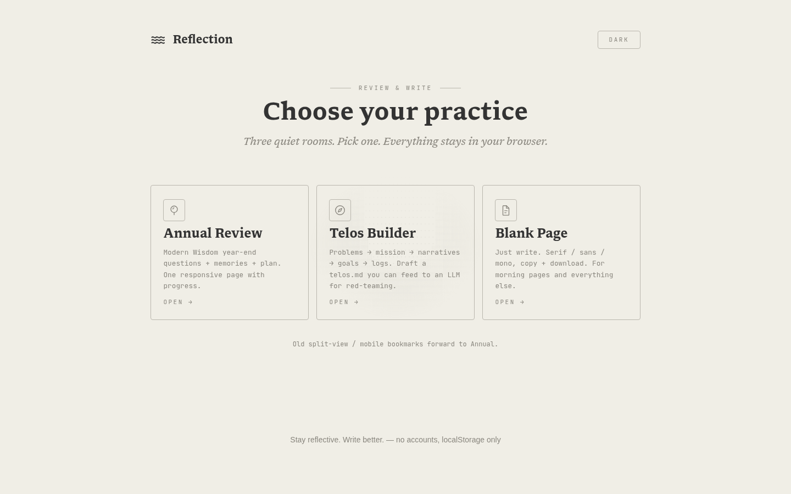

# Reflection: Review & Write

A minimalist, atmospheric web app for reflection and focused writing — now with multiple practices. Pick one from the landing page. No accounts, everything in `localStorage`.

Live: <https://reflection-phi.vercel.app>



Live pages:
- `index.html` — landing / chooser (Annual · Telos · Blank)
- `annual.html` — Annual Review, unified responsive (48 Q, progress, `reflection-annual-v1`; answers keyed by stable question slugs, with a one-shot import of legacy positional keys and `reflection-mobile-responses` that deletes that legacy key afterward)
- `telos.html` — Telos Builder (Problems → Mission → Narratives → Goals → History → Challenges → Strategies → Logs → red-team prompt, exports `telos.md`)
- `blank.html` — Blank zen page (font cycle, word count, copy + download)
- `split-view.html` / `mobile.html` — redirect stubs → `annual.html` (kept for old bookmarks + file://, plus Vercel 308s)

## What shipped

**Oct 2026 — “paper” redesign (all pages)**
- One editorial design language for `index`, `annual`, `telos`, `blank`, and `404`: monospace outline chrome (uppercase, hairline borders, 4px radius), book-serif display type, squared raised bars with a frosted translucent surface, and soft radial-masked ambient art.
- `shared.css` is now the shared system (tokens, reset, layout, typography, buttons, borderless text surfaces, nav, footer, art, utilities, print); page components live in `assets/css/{index,annual,telos,blank}.css`.
- **Text boxes are borderless** — answers and the Blank writing surface have no border, outline, or background (focus shows a faint tint instead).
- Bottom bars (`#toolbar`, `.action-bar`) are translucent with `backdrop-filter` frosting, square corners, and a softer shadow.
- Blank's formatting toolbar compacts on narrow screens (`Bold → B`, `Italic → I`; the font control keeps its full name, MONO/SERIF/SANS) and stays on a single row from 320px up.
- Fresh light + dark captures of every page live in `docs/screenshots/`.
- **Cache fix:** the previous deploy served `/assets/(.*)` with `max-age=31536000, immutable`, so returning browsers still held the pre-redesign `shared.css`/`shared.js` and rendered a hybrid page. Both are now requested with a `?v=` cache-buster and served `must-revalidate`.

**Oct 2026 — review fix round**
- Data safety: annual answers keyed by stable question slugs with a one-shot legacy import (positional `review-N` keys + `reflection-mobile-responses`, deleted after import); debounced saves flush on `pagehide`/`visibilitychange`; quota/security save failures raise an alert banner; cross-tab edits sync via the `storage` event.
- Hardening: `innerHTML` is rebuilt against a tag/href-scheme allowlist; `blank.html` paste inserts plain text; stored editor HTML is sanitized on save and load.
- a11y: `<main>` landmark, live-region cleanup, visible `:focus-visible` rings, muted text contrast ≥ 4.5:1, unique control labels.
- Infra: cache split (code revalidates; fonts/icons immutable), absolute OG + canonical URLs, dedicated maskable icon, OFL license shipped alongside the fonts in `assets/fonts/OFL.txt`.

**Oct 2026 — Libron typeface**
- [Libron](https://github.com/nicoverbruggen/libron) v0.30 (OFL) is now the site's main font. Web kit self-hosted as 4 × WOFF2 in `assets/fonts/` and declared via `@font-face` in `shared.css`.
- Libron is the content/display face (`--font-serif`, applied to `html, body`), falling back to Georgia. Inter and Cormorant Garamond were dropped entirely. `--font-sans` is now the system UI stack (footer only), and JetBrains Mono loads from Google for the mono/UI chrome (buttons, labels, progress).

**Oct 2026 — design pass (v2, superseded by the “paper” redesign)**
- New scoped design layer in `shared.css` under `body.design-v2` (landing, annual, telos, 404). `blank.html` is untouched, so it keeps the v1 look exactly.
- Warm paper surface + single muted-bronze accent, soft radial background, ambient ASCII softened with a radial mask.
- Landing: serif wordmark masthead + wave glyph, flanked eyebrow rule, larger display title, unified card heights with line-art icons, accent reveal on hover.
- Forms: diamond-accented section headings, refined inputs with accent focus ring, pill progress/action bars, dashed template builder.

**Oct 2026 — deploy fix**
- Removed invalid top-level `excludeFiles` from `vercel.json`. Vercel's schema rejects unknown root keys, so production deploys had been failing since Oct 3; `temp/` is gitignored, so nothing needed excluding.
- `robots.txt` + `sitemap.xml` now use the real production domain `https://reflection-phi.vercel.app` and clean URLs.

**Oct 2026 — hub + hardening**
- Shared `assets/css/shared.css` + `assets/js/shared.js`: theme, clipboard fallback, sanitize, auto-resize, debounced storage, download, ASCII animator, modern bold/italic/H1/H2 (no `execCommand` for formatting).
- Early theme apply (no FOUC), button label = action (`Light` when dark). First visit honors OS color-scheme; `?theme=light|dark` overrides + persists (handy for screenshots).
- Fonts via `<link preconnect>` not `@import`; meta description + OG + twitter cards + OG image (absolute `og:image`, plus canonical and `og:url`) on the four content pages; `404.html` is `noindex` with no social cards.
- Content pages use relative `./` links (works under subpaths); `404.html` uses root-absolute paths because it is served at any depth.
- ASCII pauses on `visibilitychange`, static when `prefers-reduced-motion`.
- Unified Annual (48 Q, progress bar, 2-col memories grid); legacy split/mobile fork collapsed to redirect stubs (meta + JS + Vercel 308s).
- `innerHTML` restore sanitized against a tag/href-scheme allowlist (scripts, `on*`, and `javascript:` dropped).
- Export **Copy** + **Download .md** everywhere; telos export matches `docs/telos-framework.md` schema.
- a11y: skip links, landmarks, labeled fields, live progress region, sticky bars capped, dark-mode contrast pass.
- PWA: PNG 192/512 + apple-touch 180px in `assets/icons/`, SVG light/dark favicons + `favicon.ico`, manifest `id` + `start_url: /` + dedicated 512 maskable icon (safe-zone art).
- `vercel.json`: `cleanUrls`, 308s for legacy URLs, split caching (CSS/JS revalidate; fonts, icons, and root SVGs immutable). `404.html`, `robots.txt`, `sitemap.xml`, MIT `LICENSE`, `.gitignore`.

## Telos format

Based on `docs/telos-framework.md` (NetworkChuck / Daniel Miessler, vendored from gitignored `temp/` scratch): Problems, Missions (`I think one of the biggest problems is [X], which is why I am focusing on [Y].`), Narratives (8/15/30-sec), Goals (SMART checkboxes), History, Challenges, Strategies, Logs (`YYYY-MM-DD`), plus red-team prompt:

> Review my stated missions and goals against my daily logs. Identify my top three blind spots, call out where I am confusing busywork with actual progress, and highlight where my execution contradicts my stated priorities.

## File Structure

```
reflection/
├── index.html          # Landing chooser
├── annual.html         # Annual review (unified, responsive)
├── telos.html          # Telos builder (responsive)
├── blank.html          # Blank writer (responsive)
├── mobile.html         # Redirect → annual.html (legacy bookmark)
├── split-view.html     # Redirect → annual.html (legacy bookmark)
├── assets/
│   ├── css/shared.css      # shared system: tokens, base, components
│   ├── css/index.css       # landing: masthead, cards
│   ├── css/annual.css      # annual: progress strip, memories grid
│   ├── css/telos.css       # telos: builder panel, goal rows
│   ├── css/blank.css       # blank: writer, formatting toolbar
│   ├── fonts/*.woff2     # Libron web kit (self-hosted, OFL)
│   ├── fonts/OFL.txt     # SIL Open Font License text for the web kit
│   ├── js/shared.js
│   ├── icons/*.png      # icon PNGs + icon-512-maskable.png (rsvg-convert)
│   └── *.svg            # vector sources (favicon, dark variant, icon art, icon-512-maskable.svg)
├── docs/
│   ├── telos-framework.md  # Telos schema notes (vendored from gitignored temp/ scratch)
│   └── screenshots/        # light + dark captures of every page
├── favicon.ico
├── 404.html · robots.txt · sitemap.xml
├── LICENSE (MIT)
├── site.webmanifest
└── vercel.json
```

Storage keys: `reflection-global-theme`, `reflection-annual-v1` (answers keyed by stable question slugs; legacy `review-N` keys and `reflection-mobile-responses` are imported once and the legacy key deleted), `reflection-telos-v1`, `reflection-blank-v1` + `reflection-blank-font`.

## Getting Started

```bash
python3 -m http.server 8000   # open http://localhost:8000/
# or with Bun:
bunx serve -l 8000
```

No build step, no dependencies. Force a theme with `?theme=light` or `?theme=dark`.

## Deployment

Production: <https://reflection-phi.vercel.app> — the repo is connected to Vercel, so every push to `master` deploys.

If the production domain ever changes, update `robots.txt` and `sitemap.xml` to match. Keep `vercel.json` schema-valid: Vercel rejects unknown top-level keys (a stray `excludeFiles` silently broke deploys once — see above).

If you change `assets/css/shared.css` or `assets/js/shared.js`, bump the `?v=` query on their `<link>`/`<script>` tags in the five pages. Those two files were once served `immutable` for a year, so browsers that visited before the “paper” redesign still hold the old copies — the version query is what forces a fresh fetch. (Everything else revalidates normally.)

`temp/` holds gitignored scratch (including the original telos notes); the committed copy lives at `docs/telos-framework.md`.

---
*Stay reflective. Write better.*
